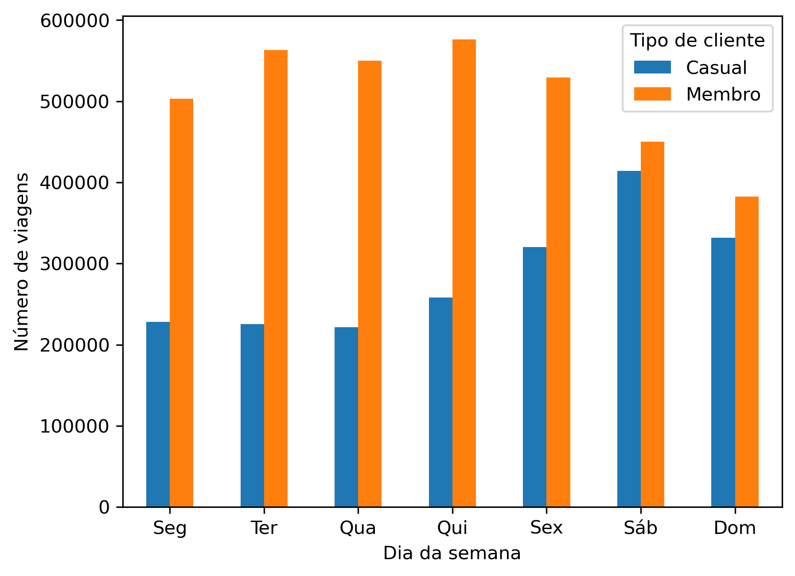

# Projeto Final do Google Data Analytics: Estudo de caso da Cyclistic

Este projeto analisa os dados da Cyclistic, uma empresa fictícia de compartilhamento de bicicletas em Chicago, com o objetivo de entender como clientes casuais e membros usam o serviço de forma diferente para ajudar a aumentar o número de assinaturas do plano anual.

## Dados utilizados

Os dados utilizados são informações públicas disponibilizadas pela Divvy Bikes e mostram o histórico de viagens realizadas ao longo de 2025.

Os arquivos `.csv` não puderam ser incluídos neste repositório devido ao limite de tamanho do GitHub. Os dados originais podem ser acessados em: [Divvy Trip Data](https://divvy-tripdata.s3.amazonaws.com/index.html).

## Ferramentas

- Python
- Pandas
- Matplotlib
- Jupyter Notebook

## Processamento

O processamento dos dados incluiu ajustes nas datas, o cálculo da duração das viagens, a remoção de registros inválidos e a criação de colunas como o dia da semana e a hora de início de cada viagem.

## Análise

As diferenças de uso entre clientes casuais e membros estão nos dias da semana em que as viagens acontecem e no tempo médio das viagens.

### Duração das viagens

A duração média das viagens ajuda a entender se as bicicletas são usadas mais para deslocamento ou lazer, já que viagens do dia a dia são mais curtas, enquanto passeios são mais longos.

| Tipo de cliente | Duração média |
| :--- | :--- |
| **Casual** | 22,6 min |
| **Membro** | 12,3 min |

### Viagens por dia da semana

O gráfico abaixo mostra que membros usam o serviço principalmente durante a semana, enquanto clientes casuais fazem mais viagens no fim de semana.

## Insights

- Clientes casuais usam as bicicletas mais para lazer e fazem viagens mais longas
- Membros usam o serviço no dia a dia com viagens curtas e frequentes durante a semana

## Recomendações

- Mostrar no aplicativo a economia ao comparar viagens avulsas com o plano anual
- Apresentar o plano anual em alguns momentos após o fim da viagem
- Oferecer um período de teste gratuito antes da assinatura
